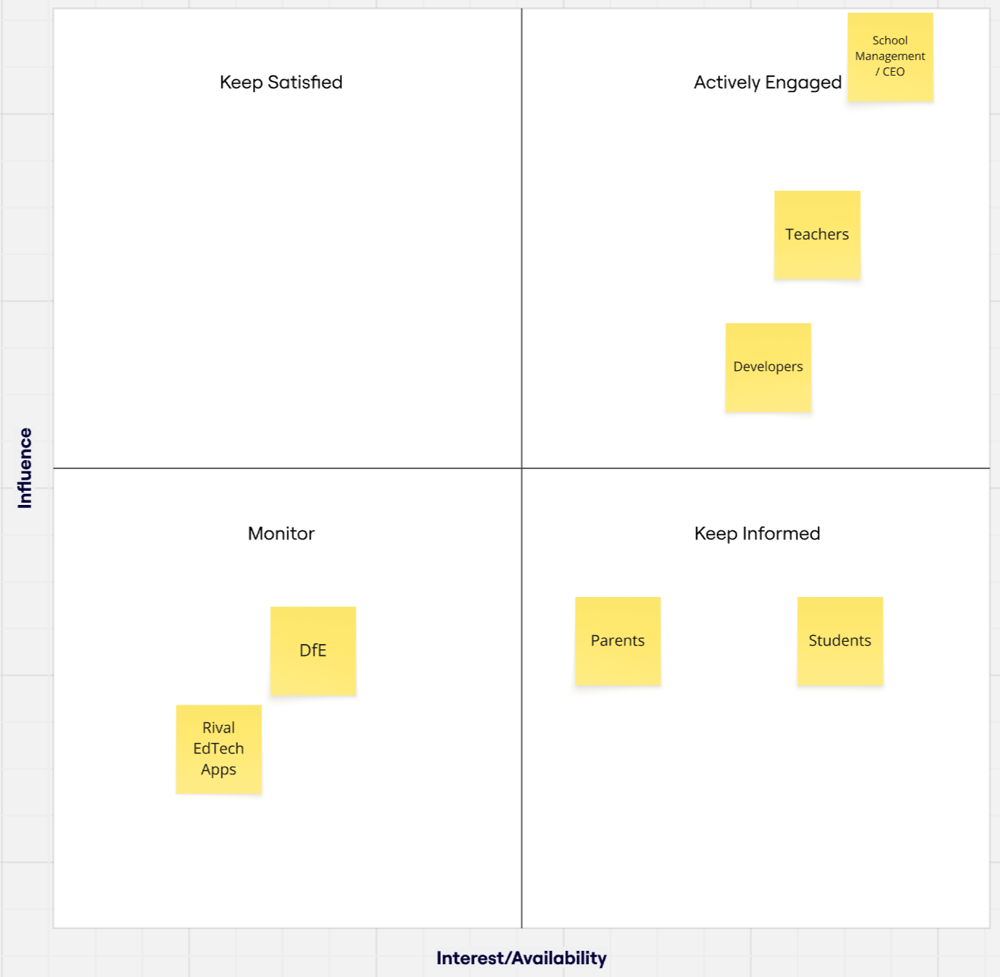
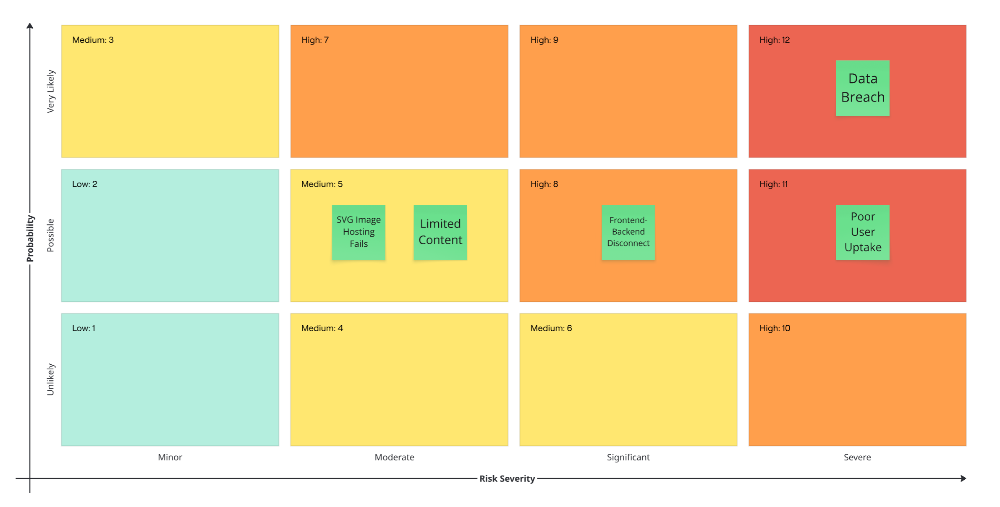

# Earth IQ App – Stakeholder & Solutions Analysis

## Problem Statement

Students at the Hive group of secondary schools are struggling to engage with non-STEM subjects. Traditional teaching methods are repetitive and often fail to create lasting interest or knowledge retention in areas like Geography. Our solution is a game that encourages interactive learning through map-based challenges, making non-STEM content more enjoyable.

## Stakeholder Analysis

Visual stakeholder analysis based on influence vs. availability:

| Stakeholder              | Quadrant         | Justification                                                                 |
|--------------------------|------------------|-------------------------------------------------------------------------------|
| School Management / CEO  | Actively Engaged | Initiated the project; strong influence on direction, strategy, and funding   |
| Teachers                 | Actively Engaged | Direct users in classrooms; influence student engagement and learning outcomes|
| Developers        | Actively Engaged | Build and shape the product; high technical influence and project interest    |
| Students                 | Keep Informed    | Primary users with high interest but low influence — design with them in mind |
| Parents                  | Keep Informed    | Concerned about student outcomes but not directly involved in decisions       |
| Department for Education | Monitor          | Not involved now, but relevant for long-term compliance and guidance          |
| Rival EdTech Apps        | Monitor          | No direct involvement, but worth observing for trends and innovation          |

## User Stories

### Students
- As a student, I want to learn geography using images and quizzes instead of textbook reading, so that it feels more fun and memorable.
- As a student, I want games that feel different each time, so I don’t get bored from repetition.
- As a student, I want to be tested on what I’ve learned in a visual way, so I can better retain the information.
- As a student, I want to learn at my own pace, so I don’t feel overwhelmed by the volume of content.

### Teachers
- As a teacher, I want tools that help reinforce content in less time, so I can maximise impact during non-core lessons.
- As a teacher, I want students to engage deeply with content, so their learning isn’t just surface-level.

### Parents
- As a parent, I want to know my child is enjoying learning again, so I feel confident about their education.
- As a parent, I want simple ways to track their progress, so I know what they’re focusing on.

### School Management
- As a school leader, I want to see students engaging more with non-STEM subjects, so we can support a more well-rounded education.
- As a CEO, I want students to develop confidence, curiosity, and critical thinking through the tools we adopt.

## Risk Assessment

We have identified five major risks to our project. These have been scored by severity and probability, and mitigation strategies have been planned that align with our MVP focus, security needs, and delivery timeline.

| Risk                         | Severity     | Probability   | Score | Justification                                                                 |
|------------------------------|--------------|----------------|--------|-------------------------------------------------------------------------------|
| Data Breach                  | Severe       | Very Likely     |  12     | MVP apps are vulnerable; secure passwords and hosting required                |
| Poor User Uptake             | Severe       | Likely          |  11     | If students don’t enjoy the game, its purpose is compromised                  |
| Frontend-Backend Disconnect  | Significant  | Possible        |  8      | MVP may break if APIs fail; testing and early deployment are key              |
| Limited Content              | Moderate     | Possible        |  5      | MVP only includes one game mode; acceptable but may limit long-term use       |
| SVG Image Hosting Fails      | Moderate     | Possible        |  5      | SVGs hosted externally could break; local storage or Supabase is fallback     |

## Risk Mitigation Strategies

### 1. Data Breach
- Passwords are securely **hashed** using `bcrypt` before storing in the database.
- No unnecessary personal data is stored (e.g. no real names or DOBs).
- We have implemented **authentication middleware with logging**, which tracks access attempts and helps detect misuse.
- Deployment will use **HTTPS** via platforms like Render or Supabase to ensure encrypted data transfer.

### 2. Poor User Uptake
- Game design is **visual and interactive**, with SVG-based map challenges to engage visual learners.
- We focused on a **simple UI structure** (as outlined in our wireframes) to reduce friction.
- We have implemented **score tracking and feedback** to motivate repeat play.
- Design is inspired by [QuizGrad Figma UI](https://www.figma.com/design/G8DrXo445hwRRbBQZLaMGS/QuizGrad-webapp--Community) for a modern look.

### 3. Frontend-Backend Disconnect
- Routes are clearly structured using the **MVC architecture** (e.g., `/users`, `/questions`, `/game`).
- Frontend JS uses `fetch()` to access well-defined endpoints listed in our sprint plan.
- We mock tested connections **locally first**, before deploying using Render to validate integration.
- API base URLs are handled using **environment variables**.

### 4. Limited Content
- Game questions are stored in the `country_questions` table with a **difficulty field** for variation.
- Content is shuffled and randomly selected, so each session feels fresh.
- We’ve scoped future stretch goals (e.g. continent categories, user-created quizzes) for future sprints.
- Teachers and testers will help us refine question variety before final presentation.

### 5. SVG Image Hosting Fails
- We are downloading SVG files from **trusted sources** (e.g. MapSVG, amCharts) and hosting them:
  - either **locally** within the project’s `/assets/` directory, or
  - via **Supabase Storage**, which provides fast and reliable image delivery.
- URLs are stored in the `outline_url` field of the `country_questions` table.
- Fallback logic will be implemented (e.g. error message or default image if loading fails).

> We acknowledge some of these risks may not be fully mitigated in the MVP but have plans for addressing them in future sprints with your feedback.

## Summary: How the Application Tackles the Core Problem

| Problem Identified in Brief                              | Our Response                                                 |
|-----------------------------------------------------------|---------------------------------------------------------------|
| Lessons feel repetitive, especially non-STEM              | Game format changes learning style with image-based challenges|
| Students struggle to retain what they learn               | Repetition + gamification improves recall                     |
| Less teaching time available for non-STEM                 | Quick-play format fits into shorter lessons                   |
| Content feels overwhelming to students                    | Bite-sized gameplay, tiered difficulty, self-paced learning   |
| Lack of enjoyment and engagement                          | Visual play, scoring, and instant feedback increase enjoyment |